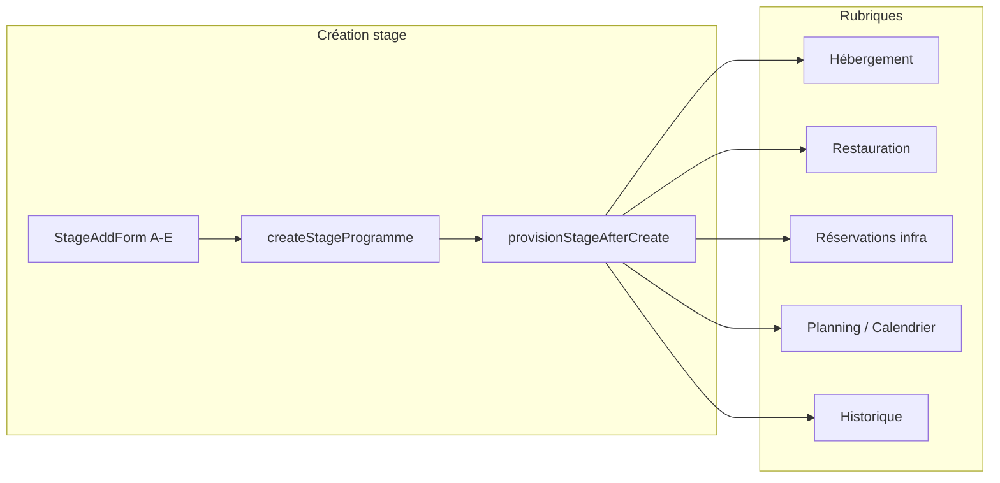

# Rapport — Architecture « Stage central » (Centre National FRMT)

**Date :** 23 mai 2026  
**Environnement :** local uniquement (`npm run dev:3001` / `npm run build`)  
**Statut build :** `npm run build` — **OK** (Next.js 16.2.6, TypeScript OK)

---

## Confirmations de périmètre

| Contrainte | Statut |
|------------|--------|
| Pas de `git push` | Respecté |
| Pas de déploiement Vercel | Respecté |
| Pas de modification destructive Supabase prod (DROP/TRUNCATE) | Respecté |
| Migrations SQL manuelles IF NOT EXISTS uniquement | Inchangé (`020_*`, `021_*`) |
| `STAGE_DELETE_ENABLED` reste `false` | Inchangé |
| Données stages / budgets existants non supprimées | Respecté |

---

## Vision livrée

**Le stage est le hub logistique :** à la création, le formulaire (sections A–E) alimente le pack `StageLogistiquePack` embarqué dans `notes` (JSON) + provision automatique vers hébergement, restauration, réservations terrains, calendrier local, historique.



---

## 1. Sidebar — 16 entrées

**Fichier :** `components/layout/nav-items.ts`, `lib/auth/permissions.ts`, `components/layout/NavMenu.tsx`

| # | Libellé | Route |
|---|---------|-------|
| 1 | Tableau de bord | `/dashboard` |
| 2 | Stages | `/stages` |
| 3 | Joueurs | `/joueurs` |
| 4 | Entraîneurs | `/entraineurs` |
| 5 | Groupes | `/groupes` |
| 6 | Infrastructures & terrains | `/infrastructures` |
| 7 | Réservations | `/reservations` |
| 8 | Calendrier | `/calendrier` |
| 9 | Planning | `/planning` |
| 10 | Hébergement | `/hebergement` |
| 11 | Restauration | `/restauration` |
| 12 | Matériel | `/materiel` |
| 13 | Budget | `/budget` |
| 14 | Rapports | `/rapports` |
| 15 | Historique | `/historique` |
| 16 | Paramètres | `/parametres` |

**Retiré de la sidebar :** Centre National hub, Import CNE, Occupation, Analyses, Logistique FRMT, Billets, Passeport, Performances, Admin (toujours accessible via `/admin` ou Paramètres).  
**Budget prévisionnels / déplacement :** liens depuis la page `/budget` (pas d’entrée sidebar dédiée).

---

## 2. Formulaire stage & provisionnement

| Fichier | Rôle |
|---------|------|
| `components/stages/StageAddForm.tsx` | Sections A–E, statuts `prevu` / `confirme` / `en_cours` / `termine` / `annule` |
| `lib/stages/validate-stage-form.ts` | Validation avant enregistrement |
| `lib/stages/stage-logistique-serializer.ts` | JSON logistique dans `notes` |
| `lib/stages/provision-stage.ts` | Orchestration Supabase + repli local |
| `lib/local-test/provision-local.ts` | localStorage : hébergement, restauration, réservations, calendrier |
| `components/stages/StagesClient.tsx` | Création → `provisionStageAfterCreate` + message utilisateur |

**À la création (si options actives) :**
- Hébergement : chambres / nuitées sur le stage + entrée `hebergement_besoins` (local)
- Restauration : besoins `besoins_restauration` avec `stage_id:…` dans `notes`
- Terrains : `reservations_infrastructure` + usage infra + entrées calendrier (local)
- Historique : `logHistorique` module `stages` (provisionnement)

---

## 3. Rubriques liées au stage

| Rubrique | Fichier(s) | Comportement |
|----------|------------|--------------|
| Hébergement | `HebergementClient.tsx` | `StageProvisionList` filtre `hebergement` |
| Restauration | `RestaurationClient.tsx` | Liste provisions + lien « Stage lié » sur besoins |
| Planning | `PlanningClient.tsx` | Créneaux stages sur courts + bandeau séances |
| Calendrier | `CalendrierClient.tsx` | Calendrier courts + liste créneaux `stage_id` |
| Infrastructures | `InfrastructuresClient.tsx` | `StageProvisionList` filtre `terrains` |
| Agrégation | `lib/data/stage-besoins.ts`, `components/stages/StageProvisionList.tsx` | Résumés par `stage_id` |

**Utilitaire :** `lib/utils/stage-link.ts` — parse `stage_id:` dans les notes.

---

## 4. Tableau de bord & alertes

| Fichier | Contenu |
|---------|---------|
| `components/dashboard/CneDashboardSection.tsx` | Stages à venir, alertes logistique, liens `/stages/[id]` |
| `lib/insights/frmt-insights.ts` | Alertes stage-centric (terrain manquant, resto non confirmée, stage &lt; 7j, conflits) |
| `components/dashboard/InsightsAlertsSection.tsx` | Affichage des insights |

Occupation CNE retirée du dashboard principal (lien `/occupation` supprimé du widget stages).

---

## 5. Historique

- Création stage + provision : `lib/stages/provision-stage.ts`, `lib/local-test/provision-local.ts`
- Filtres UI : module **Stages CNE**, **Restauration**, **Hébergement** ajoutés dans `HistoriqueClient.tsx`
- Exports PDF budget : historique via `budget-previsionnel` data layer

---

## 6. Budget prévisionnel (vérifié)

| Exigence | Implémentation |
|----------|----------------|
| Signataires PDF fixes | `SIGNATAIRES_PDF_OFFICIELS` : **KHALID AFIF**, **CHAFIK SADER** — `lib/reports/budget-previsionnel-report.ts` |
| Pas de champs signataires au formulaire | `BudgetPrevisionnelForm.tsx` — section C = totaux + taux uniquement |
| Taux EUR/MAD manuel | Champ « Taux de conversion EUR/MAD » obligatoire |
| Persistance | `signatairesOfficielsInput()` dans `lib/data/budget-previsionnel.ts` (métadonnées, non éditables UI) |
| Logo PDF | `/api/frmt-logo` dans budget prévisionnel + rapports génériques `lib/export/reports.ts` |

---

## 7. UX & PDF stages

- Modales : `components/ui/Modal.tsx` — en-tête/pied fixes, scroll corps
- Fiche stage PDF : `lib/reports/stage-fiche.ts` + exports depuis `StageDetailClient`
- Texte infrastructures : espacement « terrains / courts **sont** » corrigé

---

## 8. Mode test local

- `lib/local-test/mode.ts` — active si Supabase non configuré ou client browser indisponible
- `components/ui/LocalTestBadge.tsx` — badge visible en mode local
- Repli données : `getBesoinsRestauration`, `getCourts`, `getReservationsInfrastructure`, stages store

### Procédure de test manuelle recommandée

1. `npm run dev:3001` (ou `demarrer`)
2. Ouvrir `/stages` → Nouveau stage
3. Renseigner : **6 joueurs**, **2 coachs**, hébergement + restauration complets, **2 terrains** matin terre battue, statut **prévu** ou **confirmé**
4. Enregistrer → vérifier message provisionnement
5. Contrôler :
   - `/hebergement` — bloc provisions stage
   - `/restauration` — besoins liés + lien stage
   - `/planning` — créneaux verts stage sur courts
   - `/calendrier` — liste créneaux stages
   - `/infrastructures` — réservations terrains stage
   - `/historique` — filtre module Stages
   - `/dashboard` — alertes / prochains stages

*(Test navigateur non exécuté automatiquement dans ce rapport — build TypeScript validé.)*

---

## 9. Fichiers modifiés / ajoutés (principaux)

### Navigation & permissions
- `components/layout/nav-items.ts`
- `components/layout/NavMenu.tsx`
- `lib/auth/permissions.ts`

### Stage hub
- `lib/data/stage-besoins.ts` *(nouveau)*
- `lib/utils/stage-link.ts` *(nouveau)*
- `components/stages/StageProvisionList.tsx` *(nouveau)*
- `lib/stages/provision-stage.ts`, `lib/local-test/provision-local.ts`
- `components/stages/StageAddForm.tsx`, `StagesClient.tsx`, `StageDetailClient.tsx`

### Rubriques
- `components/hebergement/HebergementClient.tsx`
- `components/restauration/RestaurationClient.tsx`
- `components/planning/PlanningClient.tsx`
- `components/reservations/CalendrierClient.tsx`
- `components/infrastructures/InfrastructuresClient.tsx`

### Dashboard & insights
- `components/dashboard/CneDashboardSection.tsx`
- `lib/insights/frmt-insights.ts`

### Données & repli local
- `lib/data/restauration.ts`, `lib/data/courts.ts`, `lib/data/reservation-infra.ts`

### Budget & rapports
- `lib/constants/budget-previsionnel.ts`
- `lib/reports/budget-previsionnel-report.ts`
- `lib/export/reports.ts`
- `components/budget/BudgetPrevisionnelForm.tsx`

### Historique
- `components/historique/HistoriqueClient.tsx`

---

## 10. Build

```text
npm run build
✓ Compiled successfully
✓ TypeScript — Finished
✓ Static pages generated
Exit code: 0
```

---

## 11. Écarts / suite possible (hors périmètre immédiat)

- **Supabase prod :** appliquer manuellement `020_stage_logistique_jsonb.sql` et `021_budget_previsionnel.sql` si tables absentes
- **Hébergement Supabase :** pas de table `hebergement_besoins` dédiée — besoins dérivés du stage (`chambres`, pack JSON) ; localStorage pour le détail nuitées en mode test
- **Planning « séances »** : pas de table `planning_seances` séparée — les réservations infra + calendrier local portent le planning
- **Routes masquées** (`/occupation`, `/performances`, etc.) : pages toujours routables, seulement retirées du menu
- **Test E2E automatisé** : non ajouté (validation manuelle localhost recommandée)

---

## 12. Résumé exécutif

L’application est structurée autour du **stage comme hub** : création unique → provision multi-rubriques → affichage transversal avec `StageProvisionList` et alertes dashboard. La navigation est réduite à **16 entrées** conformes au cahier des charges. Le **budget prévisionnel** imprime les signataires officiels **KHALID AFIF** et **CHAFIK SADER** avec taux MAD saisi à la main, sans formulaire signataires. Le build de production **passe sans erreur** ; déploiement et push restent à la validation utilisateur en local.
